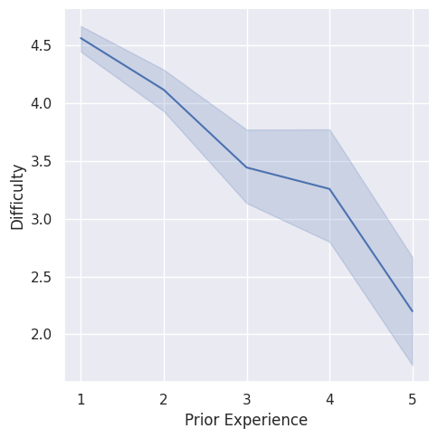
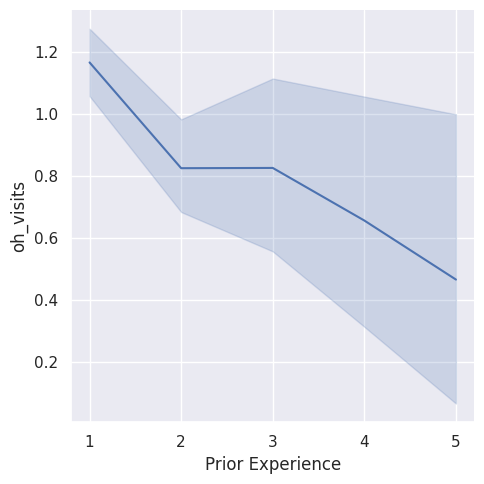

---
# Do not edit the text between these lines!
layout: default
---
 
## Diving into the Data: Our Analysis

Gabriella Kirby, Andrea Wang, Spring 2026

In this analysis, we explored the relationship between students' prior programming experience and their perceived difficulty in COMP 110. Our idea was that students with little to no prior experience find the course more difficult, and that adding beginner-friendly resources to the course site would benefit a large portion of the student population.
We first imported two survey datasets using the read_csv_rows function and combined them into one usable table using the function concat. We then used the columnar and select functions to convert the data into a column-oriented format and isolate the columns relevant to our analysis: prior_exp, difficulty, and oh_visits.
To visualize the distribution of prior experience among surveyed students, we ran the count function to identify where most students are in their programming journey. From this, we created a bar chart using the seaborn library, which revealed that the vast majority of students have no prior programming experience, establishing that beginner-targeted resources would have a wide reach.

  

 

Next, we calculated the correlation between prior experience and perceived difficulty, obtaining a value of -0.36. This indicates a moderate negative relationship, meaning that students with more experience tend to find the course less difficult. We also found a correlation of -0.15 between prior experience and office hour visits per assignment, suggesting that less experienced students are more likely to seek one-on-one help. To perform this analysis, we first converted the categorical prior_exp values into numbers (1–5) using a helper function. We then used column_ints to convert difficulty and oh_visits into integers. With these numerical values, we applied our correlation_coeff function to compute the relationships between the variables.

  

  

## Key Findings

Our analysis concludes that students with little to no programming experience find COMP 110 more difficult than those with experience. This supports our idea that additional resources, targeted for beginners, should be added to the course site. We started our analysis by determining the number of students who are new to coding, have some experience, and those who have years of experience. The bar chart showed that the vast majority of students have no prior experience, demonstrating that additional resources would benefit a large portion of the student population. We additionally implemented a function to find the relationship between those with prior experience and perceived difficulty, as well as prior experience and office hour visits per assignment. The correlation coefficient between prior experience & difficulty was -0.36, while the correlation coefficient was -0.15 between prior experience & oh_visits. These values agree with our idea, showing that as prior experience increases, difficulty and office hour visits decrease. This also means that those with no prior experience have a harder time in the class and must find 1-1 support more often. The implementation of resources such as YouTube channels and reputable websites can help those who perceived the course as more difficult, those who make up the majority of the student population. Additionally, adding these resources will allow for more time and opportunity for 1-1 support.

A potential cost of this idea is the time and effort of the instructional staff: finding YouTube channels and websites that not only teach the material but teach it in line with the course layout. Additionally, sources for beginners are not directed towards the portion of the class that has prior experience, and this group of people will potentially not engage with the resources. This trade-off could be remedied by also including resources from the next level COMP class.

In the future, it would be best to collect data on the specific topics that send students to office hours. If this were done, the resources could be refined to the topics that most students have trouble with.
